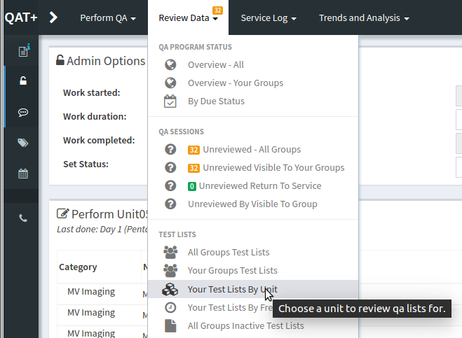
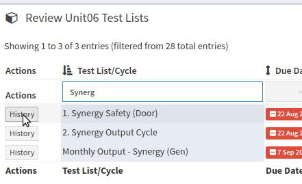
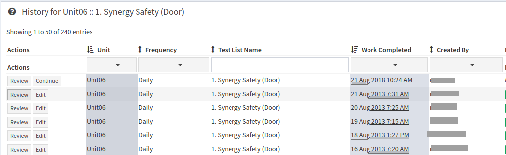

Viewing The History Of A Test List
==================================

The easiest method of viewing the hsitory for a test list is to visit the
**Your Test Lists By Unit** page from the **Review Data** dropdown at the top
of the page.

   Choose a unit to review

On the following page you can select the unit you wish to review and
from there, you will see a list of all tests lists assigned to that
unit.

   Review Test List Listings

Click the **History** button of the test list you want to review data
for and then click the **Review** button for the specific instance you
want to review.

   History listing
