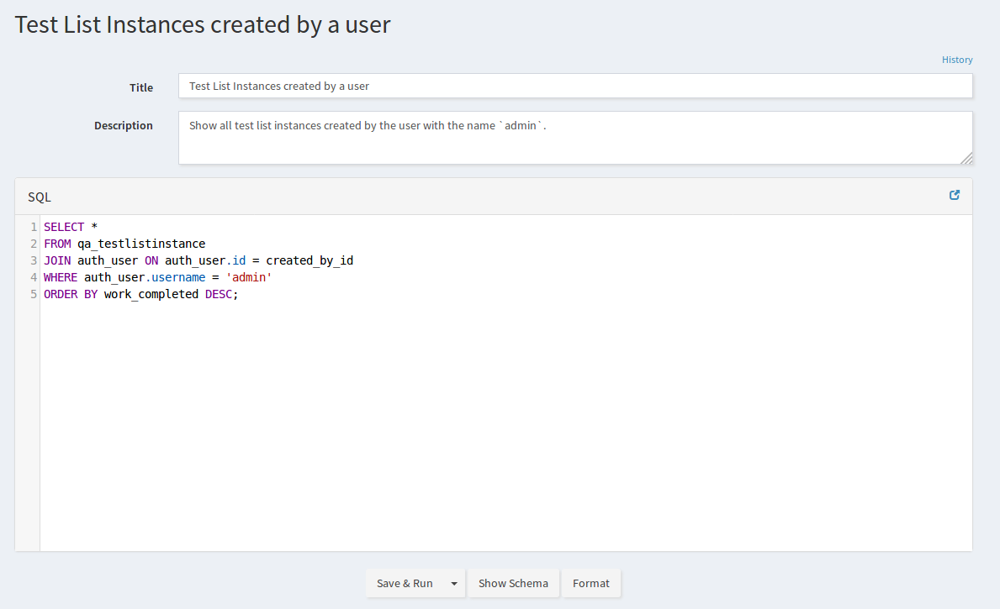
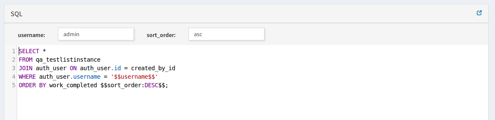
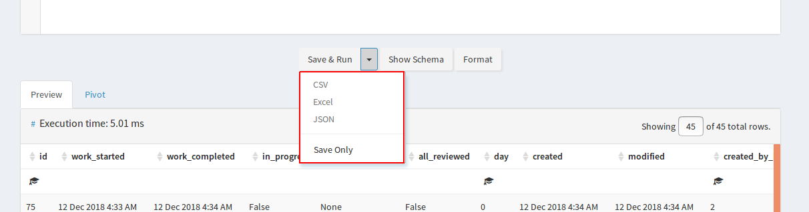
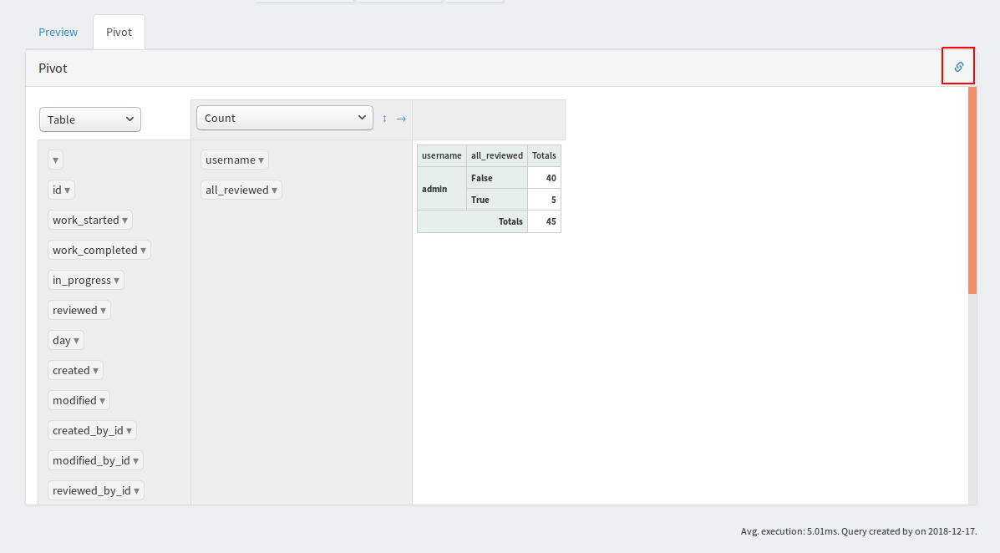

.. _reports-query_tool:

Query Tool
==========

.. warning::

    In order to use SQL Reports, your site administrator must have set up a
    read-only database user, and configured QATrack+ to use this read-only user
    in it's :ref:`DATABASES <databases>` setting.

    You must also set :ref:`USE_SQL_REPORTS = True<qatrack_config>` in your
    local_settings.py file.

As of version 3.1.0 QATrack+ has a tool for creating, running, and storing SQL
database queries/reports. To access the tool, select the **Query Tool** option
from the `Trends & Analysis` menu.

From this main query tool page, you can select an existing query to run, or
create a new one using the `New Query` or `Playground` links in the sidebar.

Permissions Required
--------------------

Currently, to access this tool a user must have the :ref:`"Can Run SQL Reports"
or "Can Create SQL Reports" <qa_auth>` permission set on their account.

Creating a new Query
--------------------

.. note::

    If you want to run ad-hoc queries or develop a new query, you can use the
    `Playground` area to run queries without saving them to the database for
    later use.

Give your query a title and description and then write your query in the SQL
text area:

   Creating a new database query

Once you have written your query you can click `Save & Run` to generate your
query. This will save the query for later use and run it now placing the results
at the bottom of the page:

.. figure:: images/query_run.png
   :alt: Results from running a DB query

   Results from running a DB query

Adding parameters
~~~~~~~~~~~~~~~~~

To add a configurable parameter to use in the query add a symbol like
`$$your_param_name$$` to your query. For each parameter an input box will be
added to configure the query.  You can use `$$your_param_name:default_value$$`
to have a default value filled in:

   Adding query parameters

Exporting the query
-------------------

If you would like to download your data, simply use the drop down on the `Save
& Run` button to export your data to CSV, Excel, or JSON format.

   Download results from a database query

Viewing the DB Schema
---------------------

You can view the database tables and columns available by clicking on the `Show
Schema` button.  A full database diagram is also available in the developer
documents: :ref:`Database Schema <dev_schema>`.

Pivot Tables
------------

After running a query you can click on the `Pivot` link at the top of the
results table to generate a pivot table for aggregating and summarizing the
data. Note the link at the top right can be shared with others to link
directly to this pivot table.

   Pivot table results from a database query

Deleting a Query
----------------

In order to delete a query, navigate to the `Saved Queries` page and click the
trash can icon next to the query.

.. figure:: images/query_delete.png
   :alt: Deleting a saved query

   Deleting a saved query
