.. _reports-reports:

Reports
=======

As of version 3.1.0 QATrack+ has a tool for generating and scheduling reports
in PDF/Excel/CSV formats.  To access the tool, select the **Reports** option
from the `Trends & Analysis` menu.

Permissions Required
--------------------

Generating reports requires a user to have the :ref:`"Can Run Reports" or "Can
Create Reports" <qa_auth>` permission set on their account.

.. _reports-available:

Available Report Types
----------------------

The report types currently available in QATrack+ are:

* QC:

    * :ref:`QC Assignment Summary <reports-qc_assignment_summary>` This report
      lists all test lists (cycles) currently assigned for the selected sites, units,
      frequencies and groups.

    * :ref:`QC Assignment Details <reports-qc_assignment_details>` This report
      includes details for all test lists (cycles) currently assigned for the
      selected sites, units, frequencies and groups. Details include tests, &
      current references, and tolerances.

    * :ref:`Test List Instance Summary <reports-qc_summary>`: This report lists
      all Test List Instances from a given time period for selected sites,
      units, frequencies, and groups.

    * :ref:`Test List Instance Details <reports-tlis>`: This report includes
      details for all Test List Instances from a given time period for a given
      Unit Test List (Cycle) assignment.

    * :ref:`Test Instance Details <reports-tis>`: This report shows QC test
      values for select tests/units.

* QC Backup Forms:

    * :ref:`QC Paper Backup Forms <reports-qc_paper_backups>` This report
      generates a PDF containing paper backup forms that can be used
      to record QC values in the case that your QATrack+ installation is 
      unavailable.

* Scheduling:

    * :ref:`Next Due Dates for QC <reports-next_due>`: This report shows QC
      tests whose next due date fall in the selected time period.

    * :ref:`Due and Overdue QC <reports-due_overdue>`: This report shows QC
      tests which are currently due or overdue

* Service Log:

    * :ref:`Service Event Summary <reports-service_event_summary>`: This report
      summarizes the Service Events logged for selected Sites & Units in a
      given time period.

    * :ref:`Service Event Details <reports-service_event_details>`: This report
      provides details for the Service Events logged for selected Sites & Units
      in a given time period.

    * :ref:`Service Event Personnel Summary <reports-service_event_personnel>`:
      This report summarizes the people involved in Service Events logged for
      selected Sites & Units over a given time period.

    * :ref:`Service Event Personnel Summary <reports-service_event_times>`:
      This report summarizes the service time, lost time, and uptime 
      percentages for selected Sites & Units over a given time period.

    * :ref:`Scheduled Service Event Assignment Summary
      <reports-service_log_assignment_summary>` This report lists all service
      event templates assigned to the selected sites, units, frequencies and
      groups.

* Service Event Scheduling:

    * :ref:`Next Due Dates for Scheduled Service Events
      <reports-service_event_due_dates>`: This report shows scheduled service
      events whose next due date fall in the selected time period.

    * :ref:`Due and Overdue Scheduled Service Events
      <reports-service_event_due>`: This report shows scheduled service events
      which are currently due or overdue

If there are other reports you would like to see please file an issue For
custom reporting please submit an `issue on BitBucket
<https://bitbucket.org/tohccmedphys/qatrackplus/issues/>`_.

Creating a New Report
---------------------

On the left hand side of the page you will find the `Report Configuration` area:

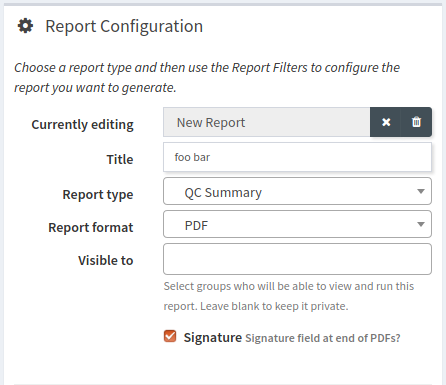

   Configuration options for a new report.

The fields in this are as follows:

Currently editing / Clear Report / Delete Report:
    This field will display `New Report` when creating a new report, or the
    name of the saved report currently being edited.

    In order to clear the current report, click the `X` button to the right
    of the `Currently editing` field.

    In order to delete the current report, click the trash can button to the
    right of the `Currently editing` field.  A popup will be displayed asking
    you to confirm the deletion.

Title
    Give your report a descripitive title

Report Type
    Select the :ref:`Report Type <reports-available>` you wish to generate.

Report Format
    Select the format you would like your report to be generated as.  Most
    reports are available as PDF, CSV, or Excel however, some may only be
    available in a subset of these formats (e.g. the :ref:`Test Instance Values
    <reports-tis>` is only available in CSV/Excel formats.

Visible To
    When you save a report, you can optionally choose to have that report
    :ref:`visible to others <reports-loading>`.  Select the groups you want to
    share your report with in this field, or leave blank to keep the report
    private.

Signature
    If you check this option, there will be a placeholder for a signature and
    the current date included at the end of PDF reports.

.. _reports-filters:

Report Filters
--------------

Most of the reports have either optional or required filters which you can
apply before generating a preview or downloading your report. Please see the
individual :ref:`report descriptions <reports-descriptions>` for explanations
about what filters are available on each report.

.. _reports-notes:

Adding Notes to Reports
-----------------------

Users can add include zero or more custom notes in their reports by clicking the 
'Add Note' button.

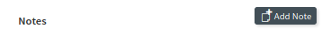

   Buttons for adding notes to reports

Once a note is added you must specify a heading for the note, and you can
optionally add some content to the note.  If you leave the note content blank a
space will be left in the report so that users can add notes later using
external PDF tools.  Notes are added at the bottom of the report.

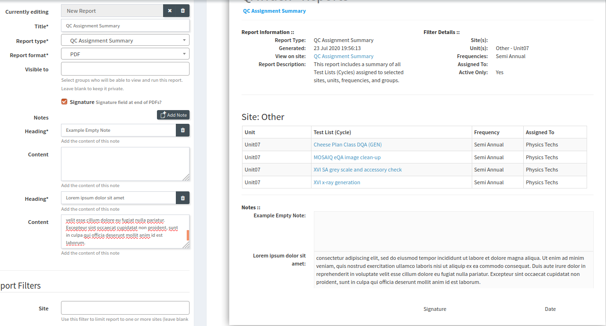

   Example report with notes included

.. _reports-saving:

Previewing, Saving, or Downloading a Report
-------------------------------------------

Underneath the `Report Filters` section are buttons for saving, downloading, and
previewing your report.

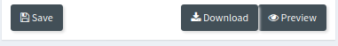

   Buttons for dowloading, saving, or previewing a report.

Once you have set up the filters required for your report, you can generate an
online preview (only available for reports which have a PDF `Report format`
option.). You can generate an online preview of your report by clicking the
`Preview` button.  The report will be generated on the QATrack+ server and then
displayed for you in the `Report Preview` area.

Clicking the `Download` button will allow you to download the report in your
desired format, while clicking the `Save` button will add this report to your
saved reports which are available for future use in the `Saved & Scheduled
Reports` section on the right hand side of the Reports page.

.. _reports-loading:

Loading a Saved Report
----------------------

On the right hand side of the screen on the Reports page you will find the
`Saved & Scheduled Reports` section which contains a table of all your
previously saved reports:

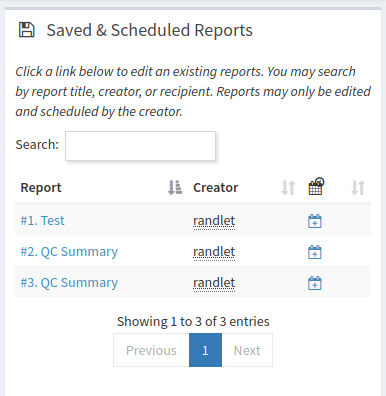

   Saved & Scheduled Reports area

To load a previously saved report, click on the title link of the report in the
`Report` column of the table.  The report will then be loaded and you can
preview it, download it, or edit its configuration and save it again.

.. _reports-scheduling:

Scheduling a Report
-------------------

In order to schedule a report for delivery you first need to :ref:`Save
<reports-saving>` it.  Then, in the `Saved & Scheduled Reports` area, click
the calendar icon beside the report you want to schedule:

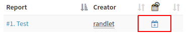

   Click the calendar icon to schedule your report.

This will bring up a dialogue with a scheduling form for you to fill out. The
fields in this form are as follows:

Schedule (required)
    Set a recurrence rule for the days that you would like your report sent.

Time of Day (required)
    Set the time of day you would like the report emailed.

Groups (optional)
    If you want the report delivered to one or more user groups, select those
    here.

Users (optional)
    To have the report delivered to individual users, select them here

Extra recipient emails (optional)
    Add any additional emails you would like this report sent to.

Once you have set the schedule and recipients, click the `Update Schedule`
button and then click `Close`.

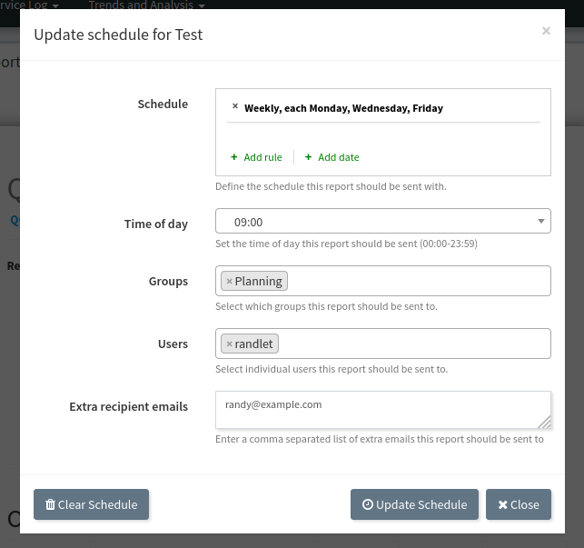

   Setting the schedule and recipients for a report.

Editing or Clearing the Schedule and/or recipients for a Report
...............................................................

To edit or clear the schedule for a report, click on the `Edit Calendar`
icon next to your report.

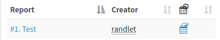

   Click the edit calendar icon to schedule your report.

You can then adjust the recipients and/or schedule for your report and click
`Update Schedule` and then `Close`.

To clear the schedule for a report open the scheduling dialogue and click the
`Clear Schedule` button and then click `Close`.

.. _reports-delete:

Deleting a Saved Report
-----------------------

In order to delete a saved report, first :ref:`load <reports-loading>` the
report then click the trash can icon next to the `Currently Editing` field:

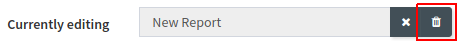

   Click the trash can icon to delete your report.

.. _reports-descriptions:

Report Type Descriptions & Options
----------------------------------

QC
..

.. _reports-qc_assignment_summary:

QC Assignment Summary
^^^^^^^^^^^^^^^^^^^^^

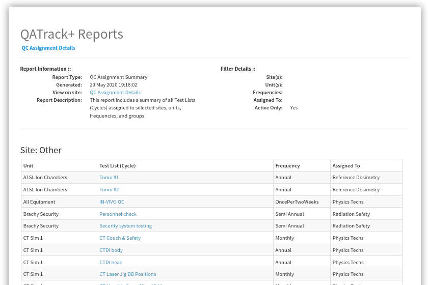

   An example QC Assignment Summary report

This report lists all test lists (cycles) currently assigned for the selected
sites, units, frequencies and groups.

The filters available for this report are:

Site (optional)
    Filter your results to one or more :ref:`Site <unit_site>`'s.

Unit (optional)
    Filter your results to one or more :ref:`Unit <units_admin>`'s.

Frequency (optional)
    Filter your results to those scheduled with a specific :ref:`frequency
    <qa_frequencies>` (e.g. Monthly).

Assigned To (optional)
    Filter your results to those assigned to a specific :ref:`group <auth_groups>`.

Active (optional)
    Select whether you want to include assignments which are active, inactive or both.

.. _reports-qc_assignment_details:

QC Assignment Details
^^^^^^^^^^^^^^^^^^^^^

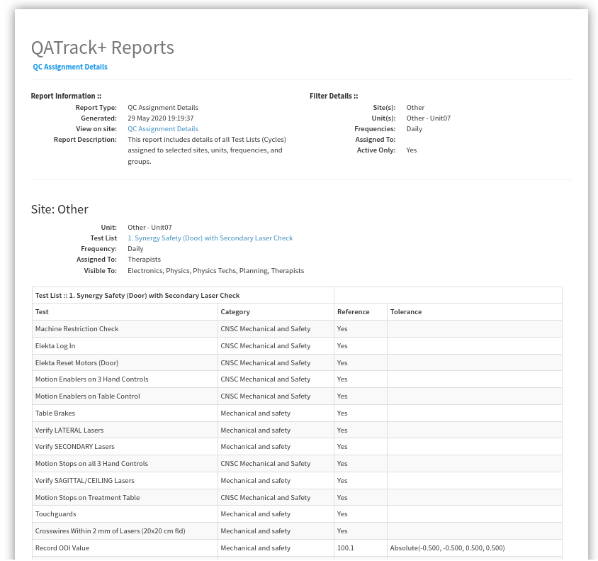

   An example QC Assignment Details report

This report includes details for all test lists (cycles) currently assigned for
the selected sites, units, frequencies and groups. Details include tests, &
current references, and tolerances.

The filters available for this report are:

Site (optional)
    Filter your results to one or more :ref:`Site <unit_site>`'s.

Unit (optional)
    Filter your results to one or more :ref:`Unit <units_admin>`'s.

Frequency (optional)
    Filter your results to those scheduled with a specific :ref:`frequency
    <qa_frequencies>` (e.g. Monthly).

Assigned To (optional)
    Filter your results to those assigned to a specific :ref:`group <auth_groups>`.

Active (optional)
    Select whether you want to include assignments which are active, inactive or both.

.. _reports-qc_summary:

Test List Instance Summary (formerly QC Performed Summary)
^^^^^^^^^^^^^^^^^^^^^^^^^^^^^^^^^^^^^^^^^^^^^^^^^^^^^^^^^^^

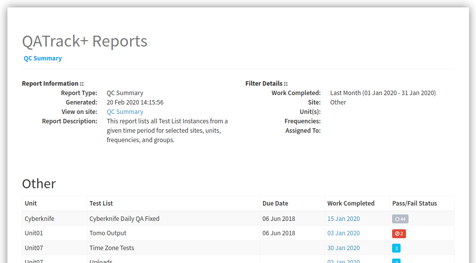

   An example QC Summary report

This report tabulates all completed Test List Instances from a given time
period for selected sites, units, frequencies, and groups.

The filters available for this report are:

Work Completed (required)
    Select the period you want to include Test List Instances from.

Site (optional)
    Filter your results to one or more :ref:`Site <unit_site>`'s.

Unit (optional)
    Filter your results to one or more :ref:`Unit <units_admin>`'s.

Frequency (optional)
    Filter your results to those scheduled with a specific :ref:`frequency
    <qa_frequencies>` (e.g. Monthly).

Assigned To (optional)
    Filter your results to those assigned to a specific :ref:`group <auth_groups>`.

.. _reports-tlis:

Test List Instance Details
^^^^^^^^^^^^^^^^^^^^^^^^^^

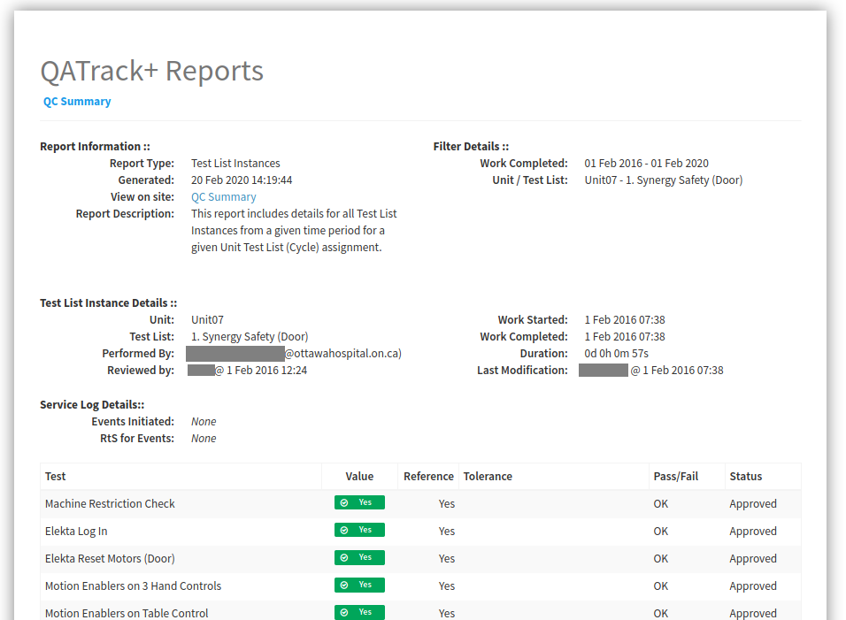

   An example Test List Instance Details report

This report includes details for all Test List Instances from a given time
period for a given Unit Test List (Cycle) assignment.

The filters available for this report are:

Work Completed (required)
    Select the period you want to include Test List Instances from.

Test List (Cycle) Assignment (required)
    Select the Test List Unit Assignments that you want to include in this report.

.. _reports-tis:

Test Instance Details
^^^^^^^^^^^^^^^^^^^^^

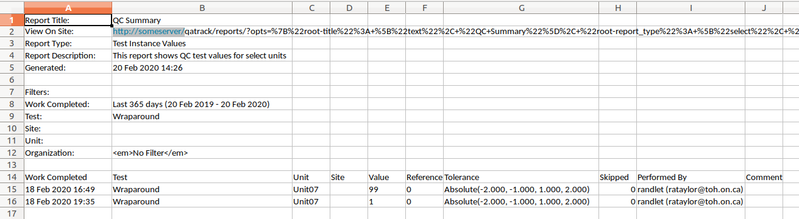

   An example Test Instance Details report

This report shows QC test values for selected tests/units.

The filters available for this report are:

Work Completed (required)
    Select the period you want to include Test values from

Test (required)
    Select the test you want to generate a report for

Site (optional)
    Filter your results to one or more :ref:`Site <unit_site>`'s.

Unit (optional)
    Filter your results to one or more :ref:`Unit <units_admin>`'s.

Organization (required)
    Select how you want your results organized.

    * One Test Instance Per Row:  Only include a single value per row in the
      spreadsheet
    * Group rows by tests that are performed on the same unit, on the same
      date.

QC Backup Forms
...............

.. _reports-qc_paper_backups:

QC Paper Backup Forms
^^^^^^^^^^^^^^^^^^^^^

.. figure:: images/qcpaperbackups.png
   :alt: An example QC Paper Backup Forms Report

   An example QC Paper Backup Forms Report

This report generates a PDF containing paper backup forms that can be used to
record QC values in the case that your QATrack+ installation is unavailable.

The filters available for this report are:

Site (optional)
    Filter your results to one or more :ref:`Site <unit_site>`'s.

Unit (optional)
    Filter your results to one or more :ref:`Unit <units_admin>`'s.

Frequency (optional)
    Filter your results to those scheduled with a specific :ref:`frequency
    <qa_frequencies>` (e.g. Monthly).

Assigned To (optional)
    Filter your results to those assigned to a specific :ref:`group <auth_groups>`.

Active (optional)
    Select whether you want to include assignments which are active, inactive or both.

Scheduling
..........

.. _reports-next_due:

Next Due Dates for QC
^^^^^^^^^^^^^^^^^^^^^

.. figure:: images/nextduedates.png
   :alt: An example Next Due Dates report

   An example Next Due Dates report

This report shows QC tests whose next due date fall in the selected (future)
time period.

The filters available for this report are:

Time Period (required)
    Select the period you want to include due dates for.

Assigned To (optional)
    Filter your results to those assigned to a specific :ref:`group <auth_groups>`.

Site (optional)
    Filter your results to one or more :ref:`Site <unit_site>`'s.

Unit (optional)
    Filter your results to one or more :ref:`Unit <units_admin>`'s.

.. _reports-due_overdue:

Due and Overdue
^^^^^^^^^^^^^^^

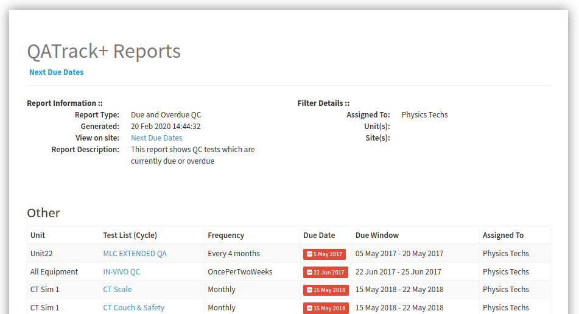

   An example Due & Overdue report

This report shows QC tests which are currently due and overdue.

The filters available for this report are:

Assigned To (optional)
    Filter your results to those assigned to a specific :ref:`group <auth_groups>`.

Site (optional)
    Filter your results to one or more :ref:`Site <unit_site>`'s.
    select them here.

Unit (optional)
    Filter your results to one or more :ref:`Unit <units_admin>`'s.

Service Log
...........

.. _reports-service_event_summary:

Service Event Summary 
^^^^^^^^^^^^^^^^^^^^^

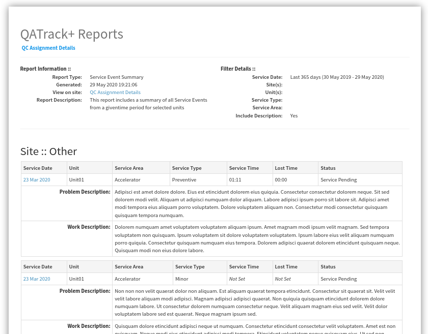

   An example Service Event Summary report

This report summarizes the Service Events logged for selected Sites & Units in
a given time period.

The filters available for this report are:

Service Date (required)
    Select the period you want to include Service Events from.

Site (optional)
    Filter your results to one or more :ref:`Site <unit_site>`'s.

Unit (optional)
    Filter your results to one or more :ref:`Unit <units_admin>`'s.

Service Type (optional)
    Filter your results to one or more :ref:`Service Types <sl_service_type>`'s.

Service Area (optional)
    Filter your results to one or more :ref:`Service Areas <sl_service_areas>`'s.

.. _reports-service_event_details:

Service Event Details
^^^^^^^^^^^^^^^^^^^^^

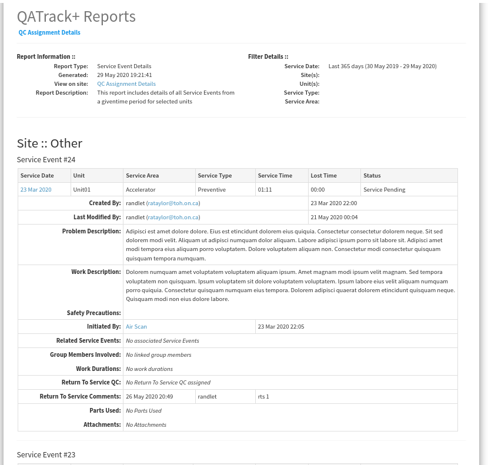

   An example Service Event Details report

This report provides details for the Service Events logged for selected Sites &
Units in a given time period.

The filters available for this report are:

Service Date (required)
    Select the period you want to include Service Events from.

Site (optional)
    Filter your results to one or more :ref:`Site <unit_site>`'s.

Unit (optional)
    Filter your results to one or more :ref:`Unit <units_admin>`'s.

Service Type (optional)
    Filter your results to one or more :ref:`Service Types <sl_service_type>`'s.

Service Area (optional)
    Filter your results to one or more :ref:`Service Areas <sl_service_areas>`'s.

.. _reports-service_event_personnel:

Service Event Personnel Summary 
^^^^^^^^^^^^^^^^^^^^^^^^^^^^^^^

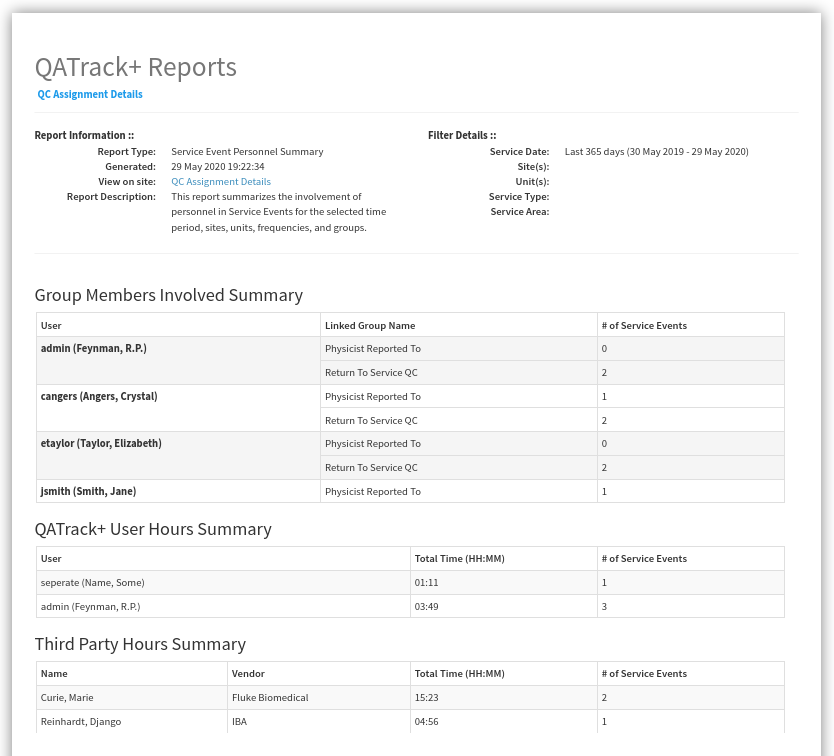

   An example Service Event Personnel report

This report summarizes the people involved in Service Events logged for
selected Sites & Units over a given time period.

The filters available for this report are:

Service Date (required)
    Select the period you want to include Service Events from.

Site (optional)
    Filter your results to one or more :ref:`Site <unit_site>`'s.

Unit (optional)
    Filter your results to one or more :ref:`Unit <units_admin>`'s.

Service Type (optional)
    Filter your results to one or more :ref:`Service Types <sl_service_type>`'s.

Service Area (optional)
    Filter your results to one or more :ref:`Service Areas <sl_service_areas>`'s.

.. _reports-service_log_assignment_summary:

Service Log Assignment Summary
^^^^^^^^^^^^^^^^^^^^^^^^^^^^^^

This report lists all scheduled service event templates currently assigned for
the selected sites, units, frequencies and groups.

The filters available for this report are:

Site (optional)
    Filter your results to one or more :ref:`Site <unit_site>`'s.

Unit (optional)
    Filter your results to one or more :ref:`Unit <units_admin>`'s.

Frequency (optional)
    Filter your results to those scheduled with a specific :ref:`frequency
    <qa_frequencies>` (e.g. Monthly).

Assigned To (optional)
    Filter your results to those assigned to a specific :ref:`group <auth_groups>`.

Active (optional)
    Select whether you want to include assignments which are active, inactive or both.

.. _reports-service_event_times:

Service Event Times
^^^^^^^^^^^^^^^^^^^

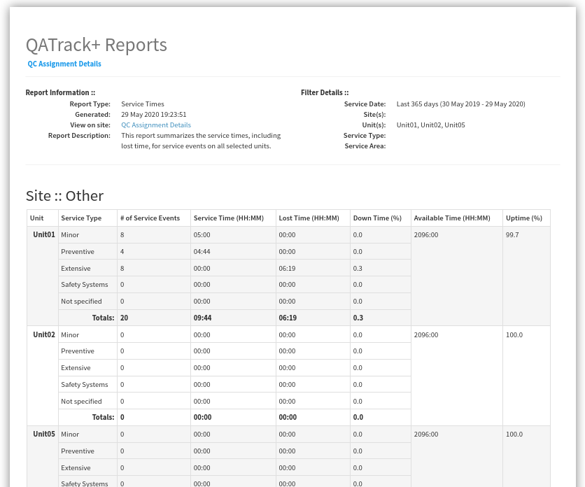

   An example Service Event Times report

This report summarizes the service time, lost time, and uptime percentages for
selected Sites & Units over a given time period.

The filters available for this report are:

Service Date (required)
    Select the period you want to include Service Events from.

Site (optional)
    Filter your results to one or more :ref:`Site <unit_site>`'s.

Unit (optional)
    Filter your results to one or more :ref:`Unit <units_admin>`'s.

Service Type (optional)
    Filter your results to one or more :ref:`Service Types <sl_service_type>`'s.
    (Note if you filter by Service Type, overall uptime percentages can not be calculated)

Service Area (optional)
    Filter your results to one or more :ref:`Service Areas <sl_service_areas>`'s.
    (Note if you filter by Service Areas, overall uptime percentages can not be calculated)

Service Event Scheduling
........................

.. _reports-service_event_due_dates:

Next Due Dates for Scheduled Service Events
^^^^^^^^^^^^^^^^^^^^^^^^^^^^^^^^^^^^^^^^^^^^

This report shows QC tests whose next due date fall in the selected (future)
time period.

The filters available for this report are:

Time Period (required)
    Select the period you want to include due dates for.

Assigned To (optional)
    Filter your results to those assigned to a specific :ref:`group <auth_groups>`.

Site (optional)
    Filter your results to one or more :ref:`Site <unit_site>`'s.

Unit (optional)
    Filter your results to one or more :ref:`Unit <units_admin>`'s.

Frequency (optional)
    Filter your results to those scheduled with a specific :ref:`frequency
    <qa_frequencies>` (e.g. Monthly).

Active (optional)
    Select whether you want to include assignments which are active, inactive
    or both.

.. _reports-service_event_due:

Due and Overdue Scheduled Service Events
^^^^^^^^^^^^^^^^^^^^^^^^^^^^^^^^^^^^^^^^

This report shows Scheduled Service Events which are currently due and overdue.

The filters available for this report are:

Site (optional)
    Filter your results to one or more :ref:`Site <unit_site>`'s.
    select them here.

Unit (optional)
    Filter your results to one or more :ref:`Unit <units_admin>`'s.

Service Area (optional):
    Filter your results to one or more :ref:`Service Areas <sl_service_areas>`'s.

Assigned To (optional)
    Filter your results to those assigned to a specific :ref:`group <auth_groups>`.

Active (optional)
    Select whether you want to include assignments which are active, inactive
    or both.
