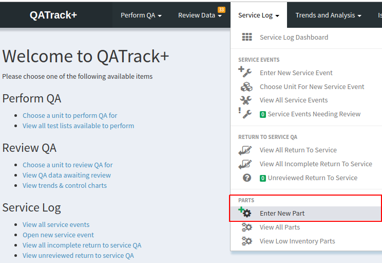
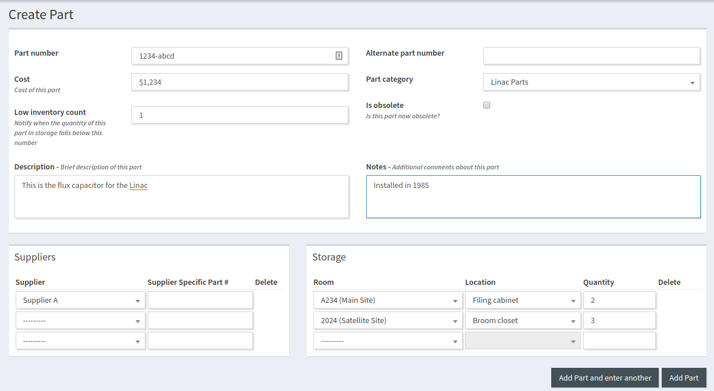
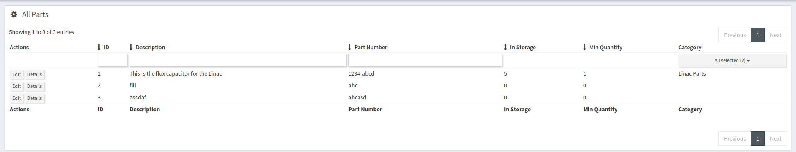
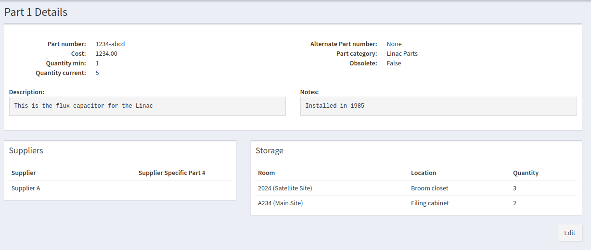
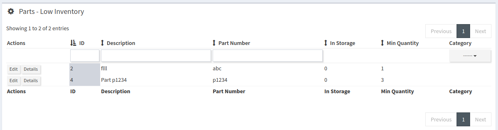

.. _parts_user:

Using the Parts App
===================

As of version 0.3.0 QATrack+ comes with a :ref:`Service Log <service_log_user>`
which inclues a `Parts` app for managing spare parts inventory.

When users are managing :term:`Service Event`\s they may choose to include
which parts from their inventory were used and they will automatically be
removed from the available inventory.

Adding Parts To Your Inventory
------------------------------

To add a new part to the inventory select the `Enter New Part` menu item from
the `Service Log` menu in the top menu bar:

   Enter new part menu item

On the next page you will be presented with a form for adding your new part:

   Creating a new part

The fields are as follows:

* **Name** Name describing what this part is.
* **Part Number** The manufacturers identification number for this part.
* **Alteranate Part Number** Alternate manufactures part number.
* **Cost** Last known cost for this part.
* **Part Category (optional)** Which category does this part belong to.
* **Low Inventory Count** When the part inventory count falls below this
  number, a message will be shown to the user and the part will show up in the
  :ref:`Low Inventory Report <parts_low_inventory>`.
* **Notes (optional)** Any additional comments about this part type?
* **Suppliers (optional)** List any known suppliers and optionally the supplier
  specific part number.
* **Storage (optional)** List the :term:`Rooms` and :term:`Location`\s where the
  part is located and how many are available in that location.
* **Attachments (optional)** Add attachments such as pdfs or images relevant to
  this part.  Images will be shown inline in the parts listing pages and on 
  the parts details page.

Once you have entered the fields click `Add Part and enter Another` to save
this part and continue entering other parts, or just click `Add Part` and you
will be returned to the :ref:`list of all parts <parts_editing>`.

.. _parts_editing:

Editing Existing Parts
----------------------

To view all existing parts select the `View All Parts` menu item from the
`Service Log` menu in the top bar.

   View all available parts

from there you can click `Edit` or `Details` to edit the part item (adjust
inventory numbers, part name etc) or view the details of the part:

   View part details

.. _parts_low_inventory:

Low Inventory Report
--------------------

To view a report about which parts are low in inventory, select the `View Low
Inventory Parts` from the `Service Log` menu in the top bar.

   View low inventory parts
