.. _service_log_guide:

Using Service Log
=================

Service Events
--------------

A :term:`Service Event` is any event where some sort of scheduled or
unscheduled maintenance or intervention that occurs for a :term:`Unit`.
Examples of `Service Events` include:

* Electron gun change
* xray tube change
* MLC calibration
* Laser adjustments
* Routine preventative maintenance (PM)

Recording this information in QATrack+ will help you keep track of the history
of your units, correlate machine performance with service events and more.

.. _service_log_new:

Initiating a new Service Event
~~~~~~~~~~~~~~~~~~~~~~~~~~~~~~

There are three ways to create a new Service Event record.

Enter a new Service Event
.........................

The first method for initiating a Service Event is to simply access the `Enter
New Service Event` menu from the `Service Log` menu in the top bar:

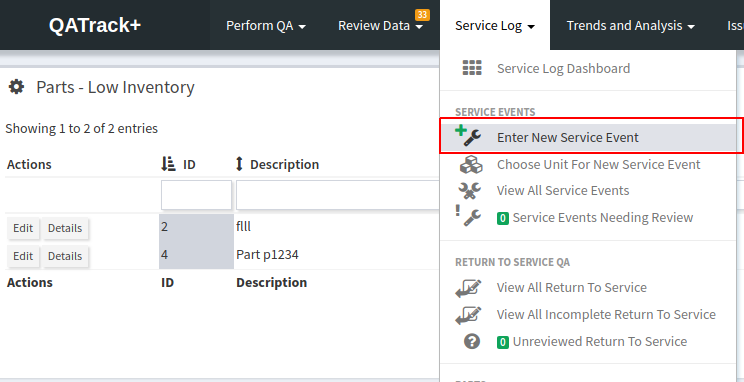

   Service Log menu

on the next page you will be presented with a number of forms used to generate
`Service Event` records.

On the main form, fill in the following fields:

* **Service Status** The current status of the Service Event. If you are
  scheduling a Service Event for later this will likely be a status like
  `Service Pending` or similar. If you are performing the Service Event now,
  this may be e.g. `Service in Progress`.

* **Date and time** The date and time the service is being performed.

* **Unit** The :term:`Unit` the service event is occuring on.

* **Service Area** The :term:`Service Area` of the Unit that the service is
  being performed on (e.g. `Treatment Table`).

* **Service Type** Select whether this is preventative maintenance, minor fix
  etc.

* **Related Service Events** After you select a Unit, the `Related Service
  Events` input will become active and you can search and select one or more
  related service events.

* **Initiated By** If this service event is occuring as a result of a :term:`QC
  Session` (e.g. a failing test) you can create a link between this Service
  Event and that QC Session. After you select a Unit, the `Initiated By`
  dropdown will be activated and show you a list of :term:`Test List`\s
  associated with the selected unit. After selecting the `Test List` you will
  be shown a popup window to select the related :term:`Test List Instance`.

* **Review Required** Does this Service Event require Review after it is
  performed?

* **Problem Description** A description of *why* this service was performed.

* **Work Description** A description of the *how* and *what* this Service Event
  entailed.

* **Safety precautions (optional)**  Any safety precautions taken during this
  Service Event.

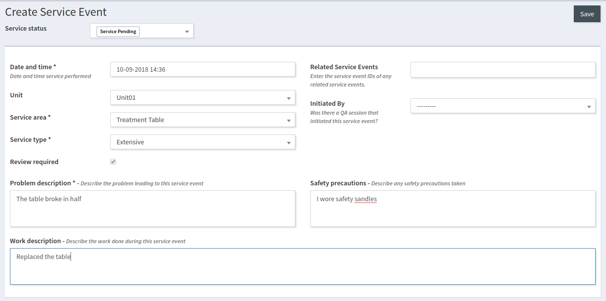

   Initiating a new Service Event

.. _service_log_durations:

Next move to the `Involved Parties and Durations` form in which you can specify
who was involved in performing this Service Event and how long it took.

* **Service Event Durations - Service Time** The time taken to perform the
  actual Service Event.

* **Service Event Durations - Lost time** How much clinical time was lost due
  to this Service Event?

* **Group Members Involved** If your QATrack+ administrator has configured
  :ref:`Group Linkers <sl_linkers>` then you may select users from different
  groups who are involved in this Service Event.

* **User and Third Party Work Durations**

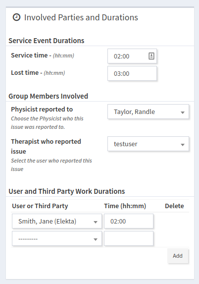

   Durations and personnel

.. _service_log_rts:

The next form allows you to specify what :term:`Return To Service QC` (RTS QC)
needs to be performed before the Unit can be released for clinical use again.

* **Test List**  Select one or more `Test List`\s that must be performed as RTS
  QC.  Once you have select the Test List, you can click the `Performed` button
  to select a completed `Test List Instance` service as RTS QC, or more likely,
  if it has not been performed, yet, this can be selected later.

* **Comments** Add any relevant comments about RTS QC here.

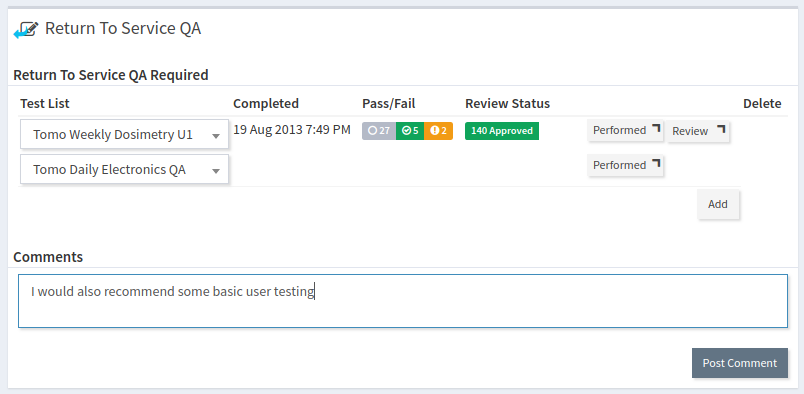

   Return to service QC

Lastly there are two forms you can use to a) Specify the Parts used in the
Service Event and where they came from and b) attach arbitrary documents to
this Service Event.

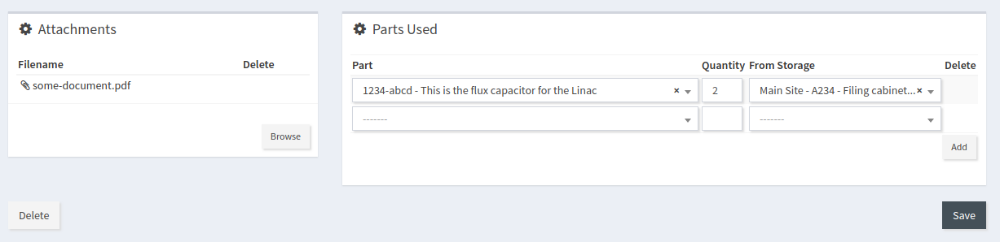

   Attachments and parts

Once all the fields are filled out you can click `Save` and you will be returned to
the :ref:`service_log_dashboard`.

Initiating a Service Event from A Test List
...........................................

It is also possible to initiate a Service event when performing a Test List by
selecting the `Initiate Service Event` checkbox (if you have the required
:ref:`permissions <permissions_admin>`):

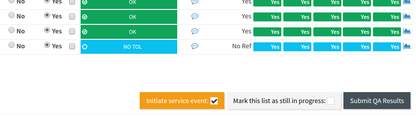

   Initiating a Service Event from a Test List

after submitting the QC you will be taken to the `Create Service Event` page
described above with the `Initiated By` field auto populated with the Test List
Instance you just performed.

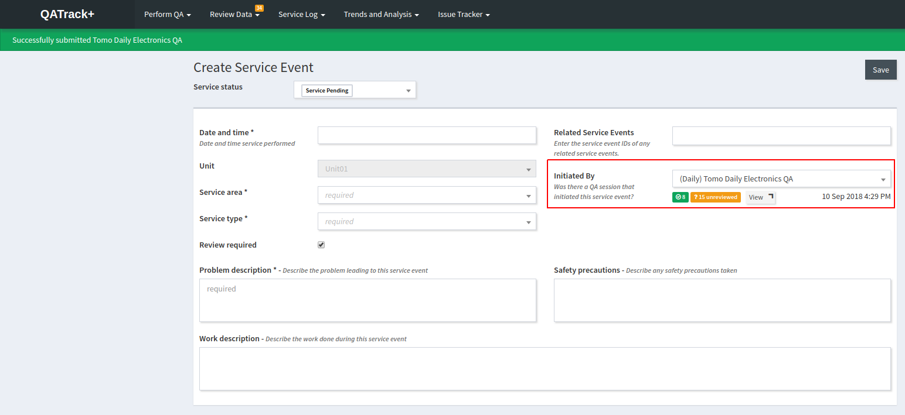

   Service Event Initialized by a Test List Instance

Initiating a Service Event from A Test List Instance
....................................................

is also possible to initiate a Service event when reviewing a Test List
Instance by clicking the `Initiate Service Event` button (if you have the required
:ref:`permissions <permissions_admin>`):

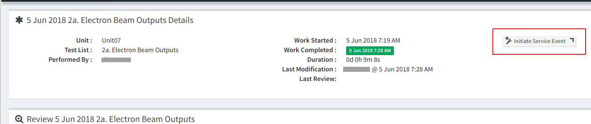

   Initiating a Service Event from a Test List Instance review

which will take you to the `Create Service Event` page described above with the
`Initiated By` field auto populated with the Test List Instance you were just
reviewing.

.. _service_log_dashboard:

Service Log Dashboard
~~~~~~~~~~~~~~~~~~~~~

The `Service Log Dashboard` provides you with an overview of the current status
of all Service Events, including which events need review, which events have
:term:`Return to Service QC` incomplete or unreviewed and a list of recent
activities.

.. figure:: images/sl_dashboard.png
   :alt: Service Log Dashboard

   Service Log Dashboard

.. _service_log_rtsqa:

Return To Service QC
--------------------

Integral to the Service Log app is the concept of Return to Service QC (RTS QC)
which is to say, :term:`Test List`\s that must be performed before the Unit can
be released for clinical use after a Service Event. To view which RTS QC is
pending, select the `View All Incomplete Return To Service` menu item from the
`Service Log` menu, or click on the `Incomplete` button on the Service Log
dashboard.

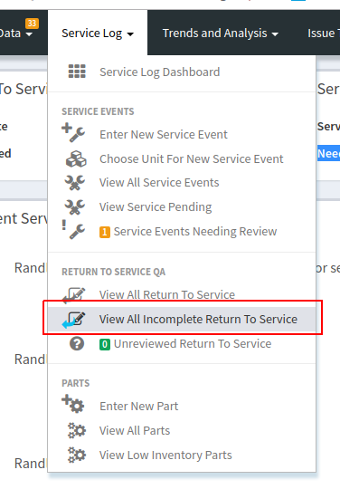

   Return To Service Menu

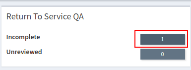

   Return To Service Button

This will take you to a listing of incomplete RTS QC.

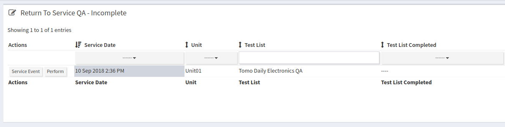

   Return To Service List

To perform an RTS QC Test List, click the `Perform` button and perform the Test
List. After performing the Test List, the resulting Test List Instance will be
placed in the `Unreviewed Return To Service` queue which you can view using the
`Unreviewed Return To Service` menu item in the Service Log menu.

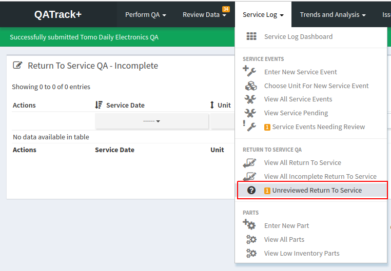

   Return To Service RTS QC Review Menu

Selecting that menu will take you the listing of all unreviewed return to
service QC from where you can :ref:`review the data using the usual routine
<qa_review>`.

.. _service_log_review:

Reviewing Service Events
------------------------

After all required RTS QC has been performed, you will want to review your
Service Event.  Select the `Service Events Needing Review` menu item from the
Service Log menu:

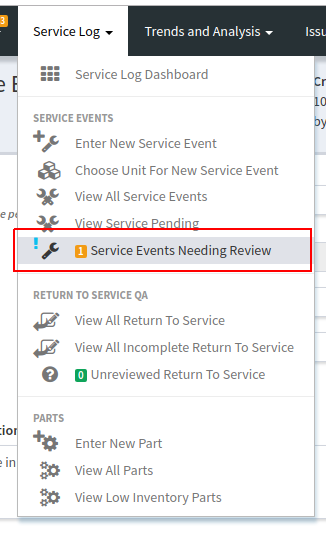

   Return To Service Review Menu

From there click on the `Edit` button of the Service Event you want to review:

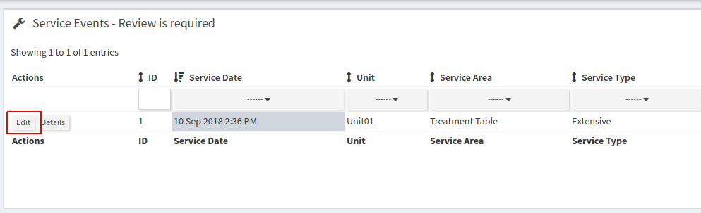

   Unreviewed Service Event List

and select the appropriate :term:`Service Event Status`:

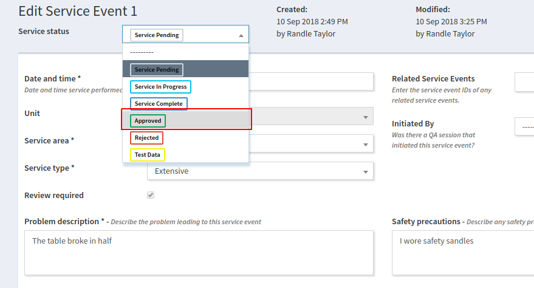

   Approving a Service Event

and click Save. This will remove the Service Event from the Unreviewed queue.

.. _service_log_downtime:

Service and Lost Time Report
----------------------------

In order to view a report about Unit uptime, select the `Service and Lost Time`
menu item from the Trends and Analysis menu:

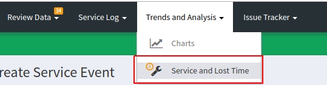

   Service and Lost Time Menu

On the next page you will see a listing of all Service Events and their
associated Service Time and Lost Time. Use the various filters to select the Unit's and date
ranges of interest:

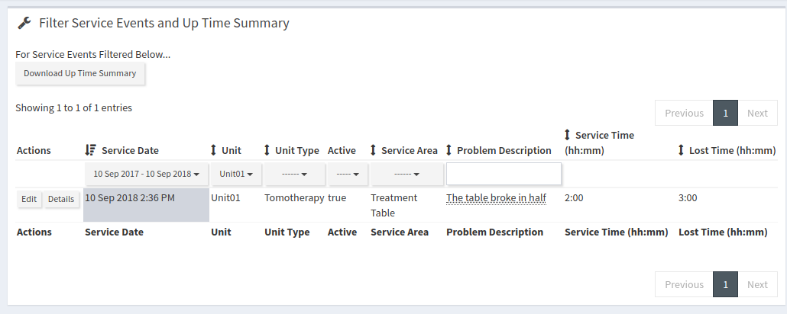

   Service log uptime summary

and then click the `Download Up Time Summary` which will generate a CSV file
with a unit by unit uptime report (this uptime report is based on the
:ref:`Available Time <units_def_new>` property of the Units):

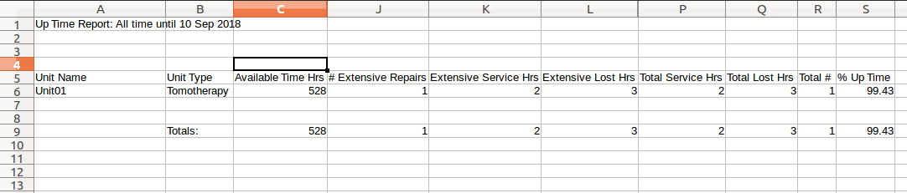

   Service Log uptime report
