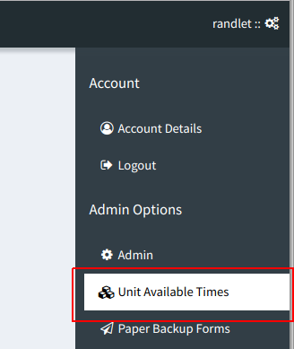
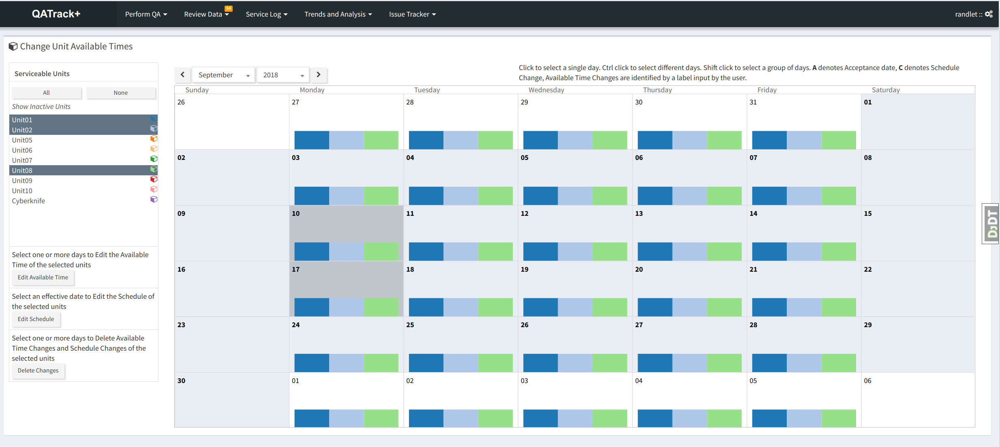
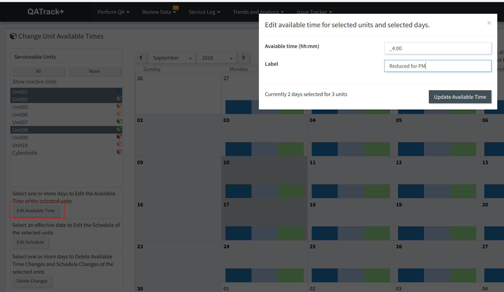
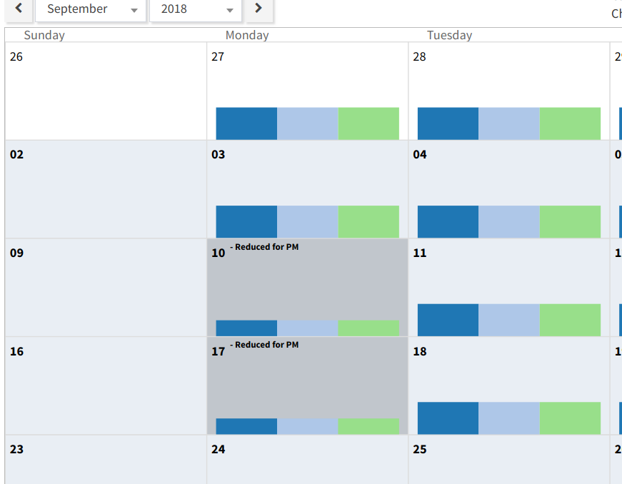
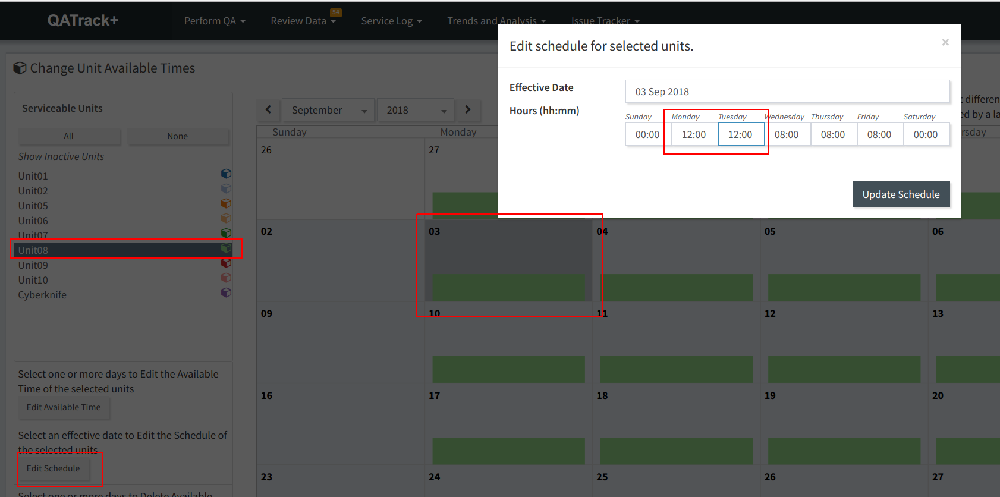
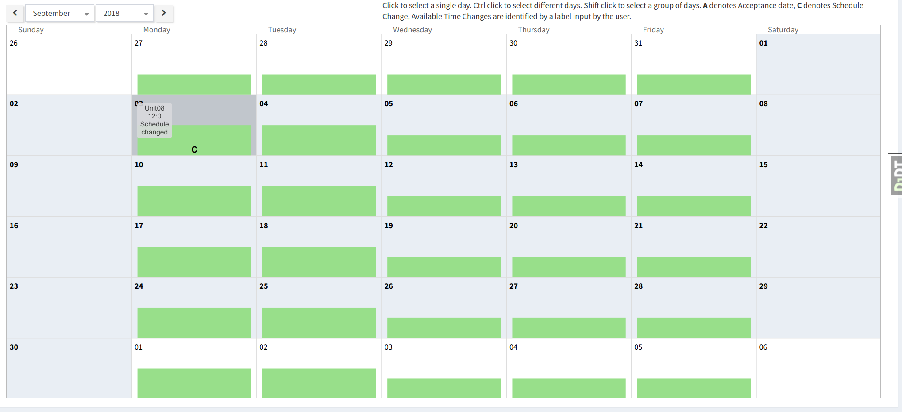
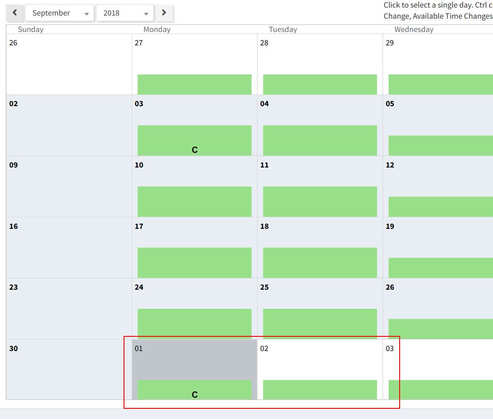
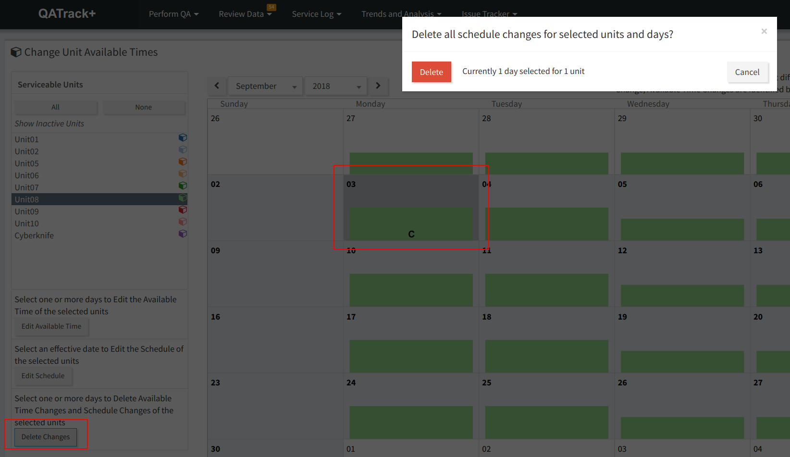

Units
=====

Setting Unit Available Time
---------------------------

Your site administrator :ref:`should have set up the nominal available time
<units_def_new>` when configuring units but there are often exceptions to
available time due to holidays or other events. To ensure your uptime/downtime
is tracked accurately, you need to record these exceptions in QATrack+. To do
this, navigate to the `Unit Available Times` menu option in the right hand
drawer menu (hover pointer over your username in the top right).

   Unit available time menu

On the left hand side of the page, select all the Units that you want to change
the available time for.  Next you can modify available times one of two ways:

1. Modifying available times for specific days
----------------------------------------------

In order to modify the available time for specific days, select the days on the
calendar that you want to make the modification for.  In the image below, two
Mondays (Sept 10th & 17th) are selected for three units:

   Selecting days on the calendar

to reduce the available hours to say 4 hours for those two dates, click the
`Edit Available Time` button on the left hand side and enter the modified
number of hours:

   Modifying the time available for units

and then click `Update Available Times`.  The calendar will then reflect the
modified hours on those days:

   Modified available time

2. Modify available times for all days after a specfic day
----------------------------------------------------------

Let's say your clinic was extending the treatment day to 12 hours on Monday &
Tues for one unit in the month of September in order to treat a backlog of
patients.  To track this in QATrack+, select the units you want to modify then
click on the Monday that you want this to start.  Then click on the `Edit
Schedule` button on the left hand sidebar and set the avaialable times:

   Changing available time after date

then click `Update Schedule`. Your changes will then be reflected in the calendar:

   Changed schedule

To return the Unit to it's regular schedule in October, Select the first Monday
in October, click `Edit Schedule` and set the hours back to 8:00.

   Reset calendar

Deleting a schedule modification
~~~~~~~~~~~~~~~~~~~~~~~~~~~~~~~~

If you make a mistake, you can remove schedule modifications: select the Unit
and Date you want to delete and then click the `Delete Changes` button on the
left sidebar:

   Deleting a schedule modification

Clicking `Delete` will remove any selected schedule modifications.
